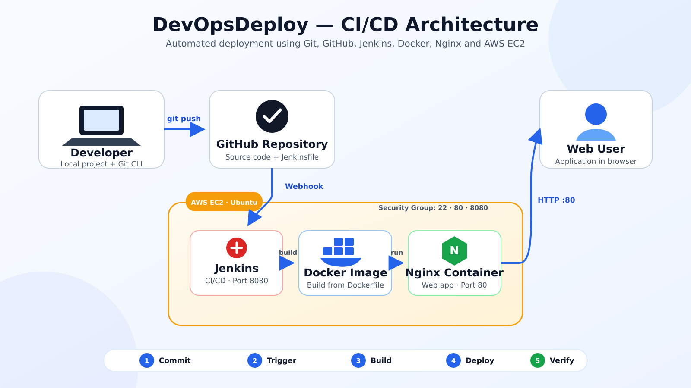

# DevOpsDeploy 🚀

DevOpsDeploy is an automated CI/CD project that deploys a containerized web application to AWS EC2 using Git, GitHub, Jenkins, Docker, Nginx and GitHub Webhooks.

## Architecture


## CI/CD Workflow

1. The developer updates the application locally.
2. Git tracks and commits the changes.
3. The code is pushed to GitHub.
4. GitHub sends a webhook event to Jenkins.
5. Jenkins checks out the latest source code.
6. Jenkins builds a Docker image.
7. The previous Docker container is removed.
8. Jenkins deploys a new Nginx container.
9. The application becomes available through the EC2 public IP.

## Technologies Used

- Git
- GitHub
- Jenkins
- Docker
- Nginx
- AWS EC2
- AWS Security Groups
- HTML
- CSS
- JavaScript

## Project Structure

```text
Devops_deploy/
├── frontend/
│   ├── index.html
│   ├── style.css
│   └── script.js
├── Dockerfile
├── Jenkinsfile
└── README.md
```

## Jenkins Pipeline Stages

- Checkout source code from GitHub
- Build the Docker image
- Remove the previous container
- Deploy the updated Docker container
- Verify the application using an HTTP request

## AWS Configuration

The project uses an Ubuntu EC2 instance to run Jenkins and Docker.

### Security Group Ports

| Port | Purpose |
|---:|---|
| 22 | SSH access |
| 80 | Web application |
| 8080 | Jenkins dashboard and webhook endpoint |

## Docker Configuration

The Docker image uses Nginx Alpine:

```dockerfile
FROM nginx:alpine

COPY frontend/ /usr/share/nginx/html/

EXPOSE 80
```

## Deployment Result

Every push to the `main` branch automatically triggers Jenkins, builds a new Docker image and deploys the latest application version on AWS EC2.

## Author

Vaishnavi Edke